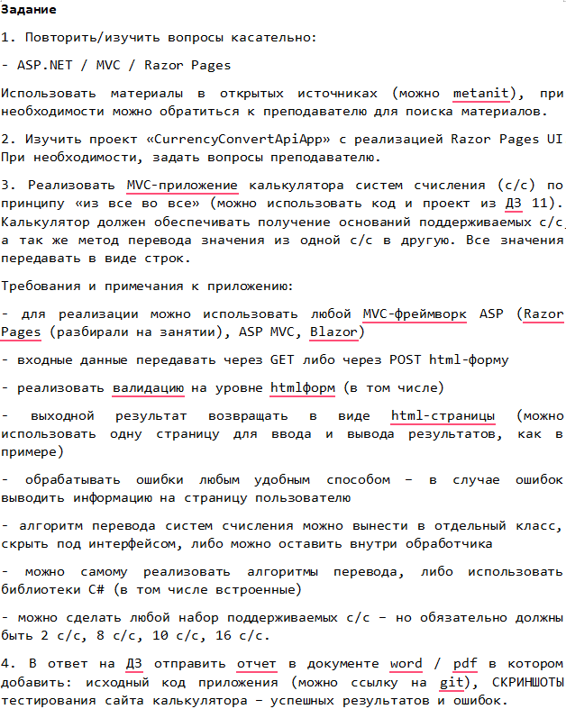
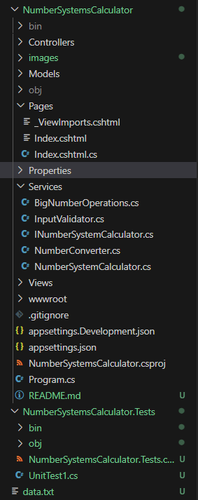
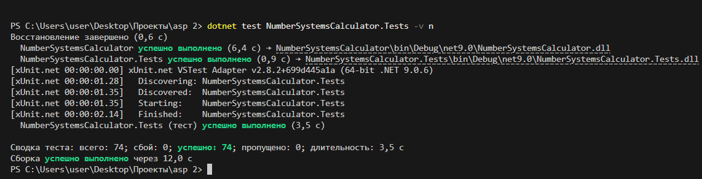

# NumberSystemsCalculator - Калькулятор систем счисления

Привет Николай Черемнов просматривающий это дз на паре!

Я Виктор Оченин, тот кто сделал по вашему приказу данное задание.

В этом README файле я расскажу че да как тут устроено и как я выполнял свою работу. 

## 📋 Оглавление

### 🎯 ДЗ
- [Выданное задание](#выданное-задание)

### 🏗️ Архитектура и структура
- [Структура проекта](#структура-проекта)
- [Папка Services](#папка-services)
  - [INumberSystemCalculator.cs](#1-inumbersystemcalculatorcs)
  - [NumberSystemCalculator.cs](#2-numbersystemcalculatorcs)
  - [NumberConverter.cs](#3-numberconvertercs)
  - [BigNumberOperations.cs](#4-bignumberoperationscs)
  - [InputValidator.cs](#5-inputvalidatorcs)

### 🎨 Пользовательский интерфейс
- [Pages/Razor Pages](#pagesrazor-pages)
  - [Index.cshtml.cs](#1-indexcshtmlcs)
  - [Index.cshtml](#2-indexcshtml)

### ⚙️ Алгоритмы и функционал
- [Алгоритмы работы приложения](#алгоритмы-работы-приложения)
- [Процесс вычисления](#процесс-вычисления)
- [Обработка ошибок](#обработка-ошибок)
- [Оптимизация производительности](#оптимизация-производительности)

### 📊 Возможности и характеристики
- [Возможности приложения](#возможности-приложения)
- [Структура данных](#структура-данных)
- [Безопасность](#безопасность)
- [Производительность](#производительность)

### 🧪 Тестирование
- [Тесты](#тесты)
- [Результаты тестов](#результаты-тестов)

### 🏁 Завершение
- [Финал](#финал)

## Выданное задание:



## 1. Повторил. 
Вот доказательством ссылка: https://metanit.com/sharp/aspnet5/ (Это просто методичка)

## 2. Изучил.
Вот доказательством ссылка: https://disk.yandex.ru/d/LQeAv_DPTZakzA (Это просто ссылка на диск с проектом)

## 3. Ну началось...
Прям сильно комментировать исходя из задания я не буду. Сил после него уже нет. Хотя давайте посмотрим...

## Структура проекта



Открыл на показ только наиболее важные папки в остальных все из изначального шаблона. 

Расскажу теперь по отдельности про файлы, алгоритмы работы методов, тесты и бла-бла-бла.

Ну чтож...

<div align="center">
  
  <div style="font-size: 2.5em; font-weight: bold; margin-top: 20px;">Поехали</div>
</div>


## Папка Services

Начну с нее так как большая логика в ней. 

### 1. INumberSystemCalculator.cs 

😐 Просто интерфейс для калькулятора систем счисления. 

```csharp
namespace NumberSystemsCalculator.Services
{
    public interface INumberSystemCalculator
    {
        string Calculate(string number1, int base1, string number2, int base2, string operation, int resultBase);

        Task<string> CalculateAsync(string number1, int base1, string number2, int base2, string operation, int resultBase);
    }
} 
```

**Методы**:
- `Calculate()` - Синхронный метод вычислений
- `CalculateAsync()` - Асинхронный метод вычислений

**Параметры**: number1, base1, number2, base2, operation, resultBase

<br>

### 2. NumberSystemCalculator.cs

💪 Это мой любимый, основной класс на котором все держиться. 

```csharp
using System.Numerics;
using System.Threading.Tasks;
using System;

namespace NumberSystemsCalculator.Services
{
    public static class NumberSystemCalculator
    {
        public static string Calculate(string number1, int base1, string number2, int base2, string operation, int resultBase)
        {
            return CalculateAsync(number1, base1, number2, base2, operation, resultBase).GetAwaiter().GetResult();
        }

        public static async Task<string> CalculateAsync(string number1, int base1, string number2, int base2, string operation, int resultBase)
        {
            InputValidator.ValidateCalculationInput(number1, number2, operation);

            BigInteger bigIntValue1, bigIntValue2;
            decimal fractionalValue1 = 0, fractionalValue2 = 0;
            
            try
            {
                var task1 = Task.Run(() => NumberConverter.ConvertToBigInteger(number1, base1));
                var task2 = Task.Run(() => NumberConverter.ConvertToBigInteger(number2, base2));
                
                await Task.WhenAll(task1, task2);
                
                (bigIntValue1, fractionalValue1) = await task1;
                (bigIntValue2, fractionalValue2) = await task2;
            }
            catch (ArgumentException)
            {
                throw;
            }
            catch (Exception ex)
            {
                throw new ArgumentException($"Некорректное значение для указанной системы счисления: {ex.Message}");
            }

            var (bigIntResult, fractionalResult) = BigNumberOperations.PerformOperation(
                operation, bigIntValue1, fractionalValue1, bigIntValue2, fractionalValue2);

            return await Task.Run(() => NumberConverter.ConvertFromBigInteger(bigIntResult, fractionalResult, resultBase));
        }
    }
} 
```

**Методы**:

**Calculate()** - Синхронная обертка для асинхронного метода
- **Алгоритм**: Вызывает CalculateAsync и ждет результат

**CalculateAsync()** - Основной метод вычислений
- **Алгоритм**:
  1. Валидация входных данных через `InputValidator`
  2. Параллельное преобразование чисел в BigInteger через `NumberConverter`
  3. Выполнение арифметической операции через `BigNumberOperations`
  4. Преобразование результата в целевую систему счисления
  5. Возврат результата

<br>

### 3. NumberConverter.cs

😡Ну а это мой ненавистный файл конвертирования в котором я ОЧЕНЬ ДОЛГО провозился работая над корректной конвертации различных случаев.

**Основные методы**:

(Да, разделил их на две группы).

**ConvertToBigInteger()** - Преобразование строки в BigInteger и дробную часть
```csharp
public static (BigInteger integerPart, decimal fractionalPart) ConvertToBigInteger(string value, int fromBase)
        {
            string cacheKey = $"{value}_{fromBase}";
            lock (_cacheLock)
            {
                if (_conversionCache.TryGetValue(cacheKey, out var cachedResult))
                    return cachedResult;
            }

            if (string.IsNullOrWhiteSpace(value))
                throw new ArgumentException($"Число не может быть пустым для основания {fromBase}.");

            (BigInteger intPart, decimal fracPart) result;

            if (fromBase == 10)
            {
                string normalizedValue = value.Replace(',', '.');
                
                if (decimal.TryParse(normalizedValue, System.Globalization.NumberStyles.Any, System.Globalization.CultureInfo.InvariantCulture, out decimal decimalResult))
                {
                    BigInteger intPart = (BigInteger)Math.Floor(decimalResult);
                    decimal fracPart = decimalResult - (decimal)intPart;
                    result = (intPart, fracPart);
                }
                else if (BigInteger.TryParse(normalizedValue, out BigInteger bigIntResult))
                {
                    result = (bigIntResult, 0);
                }
                else
                {
                    throw new ArgumentException($"Некорректное десятичное число '{value}' для основания {fromBase}.");
                }
            }
            else
            {
                string normalizedInput = value.Replace(',', '.');
                string[] parts = normalizedInput.Split('.');
                
                if (parts.Length > 2)
                    throw new ArgumentException($"Некорректный формат числа '{value}' для основания {fromBase}.");

                try
                {
                    BigInteger intPart = ConvertFromBase(parts[0], fromBase);
                    decimal fracPart = 0;

                    if (parts.Length == 2 && !string.IsNullOrEmpty(parts[1]))
                    {
                        fracPart = ConvertFractionalPart(parts[1], fromBase);
                    }

                    result = (intPart, fracPart);
                }
                catch (FormatException)
                {
                    throw new ArgumentException($"Некорректное число '{value}' для системы счисления с основанием {fromBase}.");
                }
            }

            lock (_cacheLock)
            {
                if (_conversionCache.Count > 1000)
                {
                    _conversionCache.Clear();
                }
                _conversionCache[cacheKey] = result;
            }

            return result;
        }
```

- **Алгоритм**:
  1. Проверка кэша для оптимизации (вычленение уже сделанных вычеслений для экономии памяти)
  2. Нормализация входной строки (замена запятых на точки(учел неумелость ребят))
  3. Разделение на целую и дробную части
  4. Преобразование целой части через `ConvertFromBase()`
  5. Преобразование дробной части через `ConvertFractionalPart()`
  6. Кэширование результата

<br>
<br>

**ConvertFromBigInteger()** - Преобразование BigInteger в строку
```csharp
public static string ConvertFromBigInteger(BigInteger integerPart, decimal fractionalPart, int toBase)
        {
            if (toBase == 10)
            {
                if (fractionalPart == 0)
                    return integerPart.ToString();
                else
                    return ((decimal)integerPart + fractionalPart).ToString();
            }

            if (integerPart < 0)
            {
                string absResult = ConvertBigIntegerToString(BigInteger.Abs(integerPart), toBase);
                return "-" + absResult;
            }

            string convertedResult = ConvertBigIntegerToString(integerPart, toBase);
            if (fractionalPart > 0)
            {
                string fractionalString = ConvertFractionalPartToString(fractionalPart, toBase);
                convertedResult += "." + fractionalString;
            }
            return convertedResult;
        }
```

- **Алгоритм**:
  1. Специальная обработка для десятичной системы
  2. Обработка отрицательных чисел
  3. Преобразование целой части через `ConvertBigIntegerToString()`
  4. Добавление дробной части при необходимости

<br>
<br>

**Вспомогательные методы**:

**ConvertFractionalPart()** - Преобразование дробной части
```csharp
        private static decimal ConvertFractionalPart(string fractionalPart, int fromBase)
        {
            decimal result = 0;
            decimal divisor = fromBase;

            foreach (char digit in fractionalPart)
            {
                int digitValue = GetDigitValue(digit, fromBase);
                result += digitValue / divisor;
                divisor *= fromBase;
            }

            return result;
        }
```
- **Алгоритм**: Последовательное деление на основание системы счисления

<br>

**ConvertBigIntegerToString()** - Преобразование BigInteger в строку
```csharp
private static string ConvertBigIntegerToString(BigInteger value, int toBase)
        {
            if (value == BigInteger.Zero) return "0";
            
            Span<char> buffer = stackalloc char[64];
            int index = 0;
            BigInteger temp = value;
            
            while (temp > BigInteger.Zero)
            {
                BigInteger remainder = temp % toBase;
                buffer[index++] = GetDigitChar((int)remainder, toBase);
                temp /= toBase;
            }
            
            var result = new char[index];
            for (int i = 0; i < index; i++)
            {
                result[i] = buffer[index - 1 - i];
            }
            
            return new string(result);
        }
```
- **Алгоритм**: Последовательное деление с остатком и сбор результата

<br>

**ConvertFractionalPartToString()** - Преобразование дробной части в строку
```csharp
private static string ConvertFractionalPartToString(decimal fractionalPart, int fromBase)
        {
            Span<char> buffer = stackalloc char[20];
            int index = 0;
            decimal temp = fractionalPart;
            
            for (int i = 0; i < 20 && temp > 0; i++)
            {
                temp *= fromBase;
                int digit = (int)Math.Floor(temp);
                buffer[index++] = GetDigitChar(digit, fromBase);
                temp -= digit;
            }
            
            return new string(buffer.Slice(0, index)).TrimEnd('0');
        }
```
- **Алгоритм**: Последовательное умножение на основание

<br>
*Пасхалка (если вы реально будете просматривать это все) 

<br>
Именно в этом месте я хотел сообщить что мой ужин составил 1 бутерброд с колбасой(Папа может - самая вкусная колбаса), настолько я погружен в написание этого файла.
<br>
<br>

**GetDigitValue()** - Получение числового значения символа
```csharp
private static int GetDigitValue(char digit, int fromBase)
        {
            if (char.IsDigit(digit))
            {
                int value = digit - '0';
                if (value >= fromBase)
                    throw new ArgumentException($"Цифра '{digit}' недопустима в системе с основанием {fromBase}");
                return value;
            }
            else if (char.IsLetter(digit))
            {
                int value = char.ToUpper(digit) - 'A' + 10;
                if (value >= fromBase)
                    throw new ArgumentException($"Цифра '{digit}' недопустима в системе с основанием {fromBase}");
                return value;
            }
            else
            {
                throw new ArgumentException($"Недопустимый символ '{digit}' для основания {fromBase}");
            }
        }
```
- **Алгоритм**: 
  - Для цифр: возврат значения 0-9
  - Для букв: возврат значения 10-15 (A-F)

<br>

**GetDigitChar()** - Получение символа по числовому значению
```csharp
private static char GetDigitChar(int digitValue, int fromBase)
        {
            if (digitValue < 10)
                return (char)('0' + digitValue);
            else
                return (char)('A' + (digitValue - 10));
        }
```

- **Алгоритм**:
  - Для значений 0-9: возврат цифр
  - Для значений 10-15: возврат букв A-F

<br>

**ConvertFromBase()** - Преобразование из заданной системы в десятичную
```csharp
private static BigInteger ConvertFromBase(string value, int fromBase)
        {
            if (fromBase == 10)
            {
                return BigInteger.Parse(value);
            }

            BigInteger result = BigInteger.Zero;
            BigInteger power = BigInteger.One;
            for (int i = value.Length - 1; i >= 0; i--)
            {
                int digitValue = GetDigitValue(value[i], fromBase);
                result += digitValue * power;
                power *= fromBase;
            }
            return result;
        }
```

- **Алгоритм**: Полиномиальное вычисление по разрядам

### 4. BigNumberOperations.cs

Наконецто новый файл!!! Я так устал это все вручную писать 😭😭😭.

Этот класс для выполнение арифметических операций с большими числами. Только и всего. 

**Методы**:

**PerformOperation()** - Выбор и выполнение операции
```csharp
 public static (BigInteger integerPart, decimal fractionalPart) PerformOperation(
            string operation,
            BigInteger int1, decimal frac1, 
            BigInteger int2, decimal frac2)
        {
            return operation switch
            {
                "+" => Add(int1, frac1, int2, frac2),
                "-" => Subtract(int1, frac1, int2, frac2),
                "*" => Multiply(int1, frac1, int2, frac2),
                "/" => Divide(int1, frac1, int2, frac2),
                _ => throw new ArgumentException($"Неподдерживаемая операция: {operation}")
            };
        }
```
- **Алгоритм**: Switch-выражение для выбора нужной операции

<br>

**Add()** - Сложение
```csharp
      public static (BigInteger integerPart, decimal fractionalPart) Add(
            BigInteger int1, decimal frac1, 
            BigInteger int2, decimal frac2)
        {
            BigInteger resultInt = int1 + int2;
            decimal resultFrac = frac1 + frac2;

            if (resultFrac >= 1)
            {
                resultInt += BigInteger.One;
                resultFrac -= 1;
            }
            else if (resultFrac < 0)
            {
                resultInt -= BigInteger.One;
                resultFrac += 1;
            }

            return (resultInt, resultFrac);
        }
```
- **Алгоритм**:
  1. Сложение целых частей
  2. Сложение дробных частей
  3. Перенос единицы при переполнении дробной части

<br>

**Subtract()** - Вычитание
```csharp
public static (BigInteger integerPart, decimal fractionalPart) Subtract(
            BigInteger int1, decimal frac1, 
            BigInteger int2, decimal frac2)
        {
            BigInteger resultInt = int1 - int2;
            decimal resultFrac = frac1 - frac2;

            if (resultFrac >= 1)
            {
                resultInt += BigInteger.One;
                resultFrac -= 1;
            }
            else if (resultFrac < 0)
            {
                resultInt -= BigInteger.One;
                resultFrac += 1;
            }

            return (resultInt, resultFrac);
        }
```
- **Алгоритм**:
  1. Вычитание целых частей
  2. Вычитание дробных частей
  3. Заем единицы при отрицательной дробной части (Вот тут я тупил)

<br>

**Multiply()** - Умножение
```csharp
public static (BigInteger integerPart, decimal fractionalPart) Multiply(
            BigInteger int1, decimal frac1, 
            BigInteger int2, decimal frac2)
        {
            BigInteger resultInt = int1 * int2;
            decimal resultFrac = frac1 * frac2;

            if (resultFrac >= 1)
            {
                resultInt += BigInteger.One;
                resultFrac -= 1;
            }

            return (resultInt, resultFrac);
        }
```
- **Алгоритм**:
  1. Умножение целых частей
  2. Умножение дробных частей
  3. Перенос единицы при переполнении

<br>

**Divide()** - Деление (вот тут сложно было)
```csharp
public static (BigInteger integerPart, decimal fractionalPart) Divide(
            BigInteger int1, decimal frac1, 
            BigInteger int2, decimal frac2)
        {
            if (int2 == BigInteger.Zero && Math.Abs(frac2) < 0.0000001m)
                throw new DivideByZeroException("Деление на ноль невозможно.");

            decimal fullResult = (decimal)int1 / (decimal)int2;

            BigInteger resultInt = (BigInteger)Math.Floor(fullResult);
            decimal resultFrac = fullResult - (decimal)resultInt;

            if (Math.Abs(frac1) > 0.0000001m || Math.Abs(frac2) > 0.0000001m)
            {
                decimal fractionalResult = frac1 / (decimal)int2;
                resultFrac += fractionalResult;
                
                if (resultFrac >= 1)
                {
                    resultInt += BigInteger.One;
                    resultFrac -= 1;
                }
                else if (resultFrac < 0)
                {
                    resultInt -= BigInteger.One;
                    resultFrac += 1;
                }
            }

            return (resultInt, resultFrac);
        }
```

- **Алгоритм**:
  1. Проверка деления на ноль
  2. Преобразование в decimal для точности
  3. Вычисление целой и дробной частей
  4. Обработка дробных частей операндов

### 5. InputValidator.cs

😵‍💫Это класс для валидация входных данных.

Некоторые валидации, я, можно сказать, сделал для "✔️". 

**Методы**:

**ValidateCalculationInput()** - Валидация основных параметров
```csharp
public static void ValidateCalculationInput(string number1, string number2, string operation)
        {
            if (string.IsNullOrWhiteSpace(number1))
                throw new ArgumentException("Первое число не может быть пустым.");
            
            if (string.IsNullOrWhiteSpace(number2))
                throw new ArgumentException("Второе число не может быть пустым.");
            
            if (string.IsNullOrWhiteSpace(operation))
                throw new ArgumentException("Операция не может быть пустой.");
        }
```

- **Алгоритм**: Проверка на null/пустые строки для чисел и операции

<br>

**ValidateDivision()** - Специальная валидация для деления
```csharp
public static void ValidateDivision(string number2, string operation)
        {
            if (operation == "/")
            {
                if (string.IsNullOrWhiteSpace(number2) || number2.Trim() == "0")
                    throw new DivideByZeroException("Деление на ноль невозможно.");
            }
        }
```
- **Алгоритм**: Проверка деления на ноль

<br>

**ValidateBase()** - Валидация основания системы счисления
```csharp
public static void ValidateBase(int baseValue, string parameterName)
        {
            if (baseValue < 2 || baseValue > 16)
                throw new ArgumentException($"Основание {parameterName} должно быть в диапазоне от 2 до 16.");
        }
```
- **Алгоритм**: Проверка диапазона 2-16

<br>

**ValidateOperation()** - Валидация арифметической операции
```csharp
public static void ValidateOperation(string operation)
        {
            var supportedOperations = new[] { "+", "-", "*", "/" };
            if (!supportedOperations.Contains(operation))
                throw new ArgumentException($"Неподдерживаемая операция: {operation}");
        }
```
- **Алгоритм**: Проверка поддержки операции (+, -, *, /)

<br>

**IsValidNumberForBase()** - Проверка корректности числа для основания
```csharp
public static bool IsValidNumberForBase(string number, int baseValue)
        {
            if (string.IsNullOrWhiteSpace(number))
                return false;

            foreach (char digit in number.Replace('.', '0').Replace(',', '0'))
            {
                if (!IsValidDigitForBase(digit, baseValue))
                    return false;
            }

            return true;
        }
```
- **Алгоритм**: Проверка каждого символа на соответствие основанию

<br>

**IsValidDigitForBase()** - Проверка корректности символа
```csharp
private static bool IsValidDigitForBase(char digit, int baseValue)
        {
            if (char.IsDigit(digit))
            {
                int value = digit - '0';
                return value < baseValue;
            }
            else if (char.IsLetter(digit))
            {
                int value = char.ToUpper(digit) - 'A' + 10;
                return value < baseValue;
            }

            return false;
        }
```
- **Алгоритм**: Проверка диапазона значений для цифр и букв

### Pages/Razor Pages

Наконецто мы в новой папке!!! УРАААА 🎉🎉🎉

### 1. Index.cshtml.cs

Модель странички для калькулятора.

```csharp
public class IndexModel : PageModel
{
    private readonly ILogger<IndexModel> _logger;

    public IndexModel(ILogger<IndexModel> logger)
    {
        _logger = logger;
        BaseOptions = new List<SelectListItem>();
    }

    [BindProperty]
    [Required(ErrorMessage = "Первое число обязательно для заполнения")]
    public string Number1 { get; set; } = string.Empty;
    
    [BindProperty]
    public int Base1 { get; set; } = 10;
    
    [BindProperty]
    [Required(ErrorMessage = "Второе число обязательно для заполнения")]
    public string Number2 { get; set; } = string.Empty;
    
    [BindProperty]
    public int Base2 { get; set; } = 10;
    
    [BindProperty]
    public string Operation { get; set; } = "+";
    
    [BindProperty]
    public int ResultBase { get; set; } = 10;
    
    public string? Result { get; set; }
    public string? Error { get; set; }

    public List<SelectListItem> BaseOptions { get; set; }
```

**Свойства**: (да-да, первый (и единственный) класс со свойствами + логгер(его обьяснять приминимость не буду, сами знаете))
- `Number1`, `Number2` - Входные числа
- `Base1`, `Base2` - Основания систем счисления
- `Operation` - Арифметическая операция
- `ResultBase` - Основание для результата
- `Result`, `Error` - Результат или ошибка
- `BaseOptions` - Список доступных оснований

**Методы**:

**OnGet()** - Обработка GET-запроса
```csharp
public void OnGet()
    {
        _logger.LogInformation("OnGet called. Base1: {Base1}, Base2: {Base2}, Operation: {Operation}, ResultBase: {ResultBase}", Base1, Base2, Operation, ResultBase);
        PopulateBaseOptions();
    }
```

- **Алгоритм**: Заполнение списка оснований систем счисления

<br>

**OnPostAsync()** - Обработка POST-запроса
```csharp
public async Task OnPostAsync()
    {
        _logger.LogInformation("OnPost called. Number1: {Number1}, Base1: {Base1}, Number2: {Number2}, Base2: {Base2}, Operation: {Operation}, ResultBase: {ResultBase}", 
            Number1, Base1, Number2, Base2, Operation, ResultBase);

        PopulateBaseOptions(); 

        if (!ModelState.IsValid)
        {
            _logger.LogWarning("ModelState is invalid.");
            
            var errors = ModelState.Values
                .SelectMany(v => v.Errors)
                .Select(e => e.ErrorMessage)
                .ToList();
            
            Error = errors.Any() ? string.Join(", ", errors) : "Пожалуйста, проверьте введенные данные.";
            Result = null;
            return;
        }

        try
        {
            _logger.LogInformation("Attempting calculation: {Number1} (base {Base1}) {Operation} {Number2} (base {Base2}) = ? (base {ResultBase})", 
                Number1, Base1, Operation, Number2, Base2, ResultBase);
            Result = await NumberSystemCalculator.CalculateAsync(Number1, Base1, Number2, Base2, Operation, ResultBase);
            Error = null;
            _logger.LogInformation("Calculation successful. Result: {Result}", Result);
        }
        catch (ArgumentException ex)
        {
            Result = null;
            Error = ex.Message;
            _logger.LogError(ex, "Validation failed: {Message}", ex.Message);
        }
        catch (DivideByZeroException ex)
        {
            Result = null;
            Error = ex.Message;
            _logger.LogError(ex, "Division by zero: {Message}", ex.Message);
        }
        catch (Exception ex)
        {
            Result = null;
            Error = "Произошла ошибка при вычислении. Пожалуйста, проверьте введенные данные.";
            _logger.LogError(ex, "Calculation failed: {Message}", ex.Message);
        }
    }
```
- **Алгоритм**:
  1. Валидация модели
  2. Заполнение списка оснований
  3. Вызов калькулятора
  4. Обработка ошибок
  5. Логирование результатов

<br>

**PopulateBaseOptions()** - Заполнение списка оснований
```csharp
private void PopulateBaseOptions()
    {
        var bases = new List<int> { 2, 8, 10, 16 };
        BaseOptions = bases.Select(b => new SelectListItem { Text = $"{GetBaseName(b)} ({b})", Value = b.ToString() }).ToList();
    }
```
- **Алгоритм**: Создание SelectListItem для оснований 2, 8, 10, 16

<br>

**GetBaseName()** - Получение названия системы счисления
```csharp
private string GetBaseName(int b)
    {
        return b switch
        {
            2 => "Двоичная",
            8 => "Восьмеричная",
            10 => "Десятичная",
            16 => "Шестнадцатеричная",
            _ => b.ToString()
        };
    }
```
- **Алгоритм**: Switch-выражение для русских названий

### 2. Index.cshtml

Представление калькулятора (версточка).


Тут дизайн нагенерил с DeepSite. Не умею стили делать. 

```html
@page
@model IndexModel
@{
    ViewData["Title"] = "Калькулятор систем счисления";
    Layout = null;
}

<!DOCTYPE html>
<html lang="ru">
<head>
    <meta charset="UTF-8">
    <meta name="viewport" content="width=device-width, initial-scale=1.0">
    <title>Калькулятор систем счисления</title>
    <script src="https://cdn.tailwindcss.com"></script>
    <link rel="stylesheet" href="https://cdnjs.cloudflare.com/ajax/libs/font-awesome/6.4.0/css/all.min.css">
    <style>
        .gradient-bg {
            background: linear-gradient(135deg, #4f46e5 0%, #8b5cf6 100%);
        }
        .input-focus:focus {
            box-shadow: 0 0 0 3px rgba(99, 102, 241, 0.3);
            border-color: #6366f1;
        }
        .result-animation {
            animation: fadeIn 0.5s ease-in-out;
        }
        @@keyframes fadeIn {
            from { opacity: 0; transform: translateY(10px); }
            to { opacity: 1; transform: translateY(0); }
        }
    </style>
</head>
<body class="bg-gray-50 min-h-screen flex items-center justify-center p-4">
    <div class="w-full max-w-md">
        <div class="gradient-bg text-white rounded-t-xl p-6 shadow-lg">
            <div class="flex items-center justify-between">
                <h1 class="text-2xl font-bold">
                    <i class="fas fa-calculator mr-2"></i> Калькулятор систем счисления
                </h1>
            </div>
            <p class="text-indigo-100 mt-2 text-sm">Арифметические операции в разных системах счисления</p>
        </div>

        <div class="bg-white rounded-b-xl shadow-lg p-6">
            <form id="calculatorForm" method="post" class="space-y-4">
                <div class="grid grid-cols-1 md:grid-cols-2 gap-4">
                    <div>
                        <label for="number1" class="block text-sm font-medium text-gray-700 mb-1">
                            <i class="fas fa-hashtag mr-1 text-indigo-500"></i> Первое число
                        </label>
                        <input type="text" id="number1" name="Number1" value="@Model.Number1" placeholder="Например: 1011, FF, 255..." 
                               class="w-full px-4 py-2 border border-gray-300 rounded-lg input-focus transition duration-200 focus:outline-none">
                    </div>

                    <div>
                        <label for="base1" class="block text-sm font-medium text-gray-700 mb-1">
                            <i class="fas fa-sort-numeric-up mr-1 text-indigo-500"></i> Система счисления
                        </label>
                        <select id="base1" name="Base1" asp-for="Base1" asp-items="Model.BaseOptions" class="w-full px-4 py-2 border border-gray-300 rounded-lg input-focus transition duration-200 focus:outline-none">
                        </select>
                    </div>
                </div>

                <div class="grid grid-cols-1 md:grid-cols-2 gap-4">
                    <div>
                        <label for="number2" class="block text-sm font-medium text-gray-700 mb-1">
                            <i class="fas fa-hashtag mr-1 text-indigo-500"></i> Второе число
                        </label>
                        <input type="text" id="number2" name="Number2" value="@Model.Number2" placeholder="Например: 1011, FF, 255..." 
                               class="w-full px-4 py-2 border border-gray-300 rounded-lg input-focus transition duration-200 focus:outline-none">
                    </div>

                    <div>
                        <label for="base2" class="block text-sm font-medium text-gray-700 mb-1">
                            <i class="fas fa-sort-numeric-up mr-1 text-indigo-500"></i> Система счисления
                        </label>
                        <select id="base2" name="Base2" asp-for="Base2" asp-items="Model.BaseOptions" class="w-full px-4 py-2 border border-gray-300 rounded-lg input-focus transition duration-200 focus:outline-none">
                        </select>
                    </div>
                </div>

                <div class="grid grid-cols-1 md:grid-cols-2 gap-4">
                    <div>
                        <label for="operation" class="block text-sm font-medium text-gray-700 mb-1">
                            <i class="fas fa-calculator mr-1 text-indigo-500"></i> Операция
                        </label>
                        <select id="operation" name="Operation" asp-for="Operation" class="w-full px-4 py-2 border border-gray-300 rounded-lg input-focus transition duration-200 focus:outline-none">
                            <option value="+">Сложение</option>
                            <option value="-">Вычитание</option>
                            <option value="*">Умножение</option>
                            <option value="/">Деление</option>
                        </select>
                    </div>

                    <div>
                        <label for="resultBase" class="block text-sm font-medium text-gray-700 mb-1">
                            <i class="fas fa-arrow-up mr-1 text-indigo-500"></i> Результат в системе
                        </label>
                        <select id="resultBase" name="ResultBase" asp-for="ResultBase" asp-items="Model.BaseOptions" class="w-full px-4 py-2 border border-gray-300 rounded-lg input-focus transition duration-200 focus:outline-none">
                        </select>
                    </div>
                </div>

                <button type="submit" class="w-full gradient-bg text-white py-3 px-4 rounded-lg font-medium hover:opacity-90 transition duration-200 shadow-md flex items-center justify-center">
                    <i class="fas fa-equals mr-2"></i> Вычислить
                </button>
            </form>

            @if (!string.IsNullOrEmpty(Model.Result))
            {
                <div id="resultContainer" class="mt-6 result-animation">
                    <div class="bg-gray-50 border border-gray-200 rounded-lg p-4">
                        <h3 class="text-sm font-medium text-gray-500 mb-1">Результат:</h3>
                        <p id="resultValue" class="text-2xl font-bold text-indigo-600">@Model.Result</p>
                    </div>
                </div>
            }

            @if (!string.IsNullOrEmpty(Model.Error))
            {
                <div id="errorContainer" class="mt-6 result-animation">
                    <div class="bg-red-50 border border-red-200 rounded-lg p-4">
                        <h3 class="text-sm font-medium text-red-500 mb-1">Ошибка:</h3>
                        <p id="errorValue" class="text-sm text-red-600">@Model.Error</p>
                    </div>
                </div>
            }

        </div>
    </div>
</body>
</html> 
```

**Особенности**:
- Использует Tailwind CSS для стилизации
- Адаптивный дизайн
- Анимации для результатов
- Font Awesome иконки
- Градиентный фон

<br>

Дальше мой асистент даст небольшое описание функционала:

## Алгоритмы работы приложения

### Процесс вычисления

1. **Валидация входных данных**
   - Проверка на пустые значения
   - Валидация оснований систем счисления
   - Проверка корректности чисел для оснований

2. **Преобразование чисел**
   - Параллельное преобразование в BigInteger
   - Обработка целой и дробной частей
   - Кэширование результатов для оптимизации

3. **Выполнение операции**
   - Выбор арифметической операции
   - Выполнение вычислений с учетом дробных частей
   - Обработка переносов и заемов

4. **Преобразование результата**
   - Конвертация в целевую систему счисления
   - Форматирование вывода

### Обработка ошибок

- **ArgumentException** - Некорректные входные данные
- **DivideByZeroException** - Деление на ноль
- **FormatException** - Неправильный формат числа
- **General Exception** - Неожиданные ошибки

### Оптимизация производительности

- **Кэширование** - Сохранение результатов преобразований
- **Параллелизм** - Одновременное преобразование чисел

## Возможности приложения

1. **Поддерживаемые системы счисления**: 2, 8, 10, 16
2. **Арифметические операции**: +, -, *, /
3. **Дробные числа**: Поддержка десятичных дробей
4. **Большие числа**: Работа с числами произвольной точности
5. **Валидация**: Проверка корректности входных данных
6. **Обработка ошибок**: Информативные сообщения об ошибках
7. **Современный UI**: Адаптивный дизайн с анимациями

## Структура данных

### Основные типы данных

- **BigInteger** - Для целых частей больших чисел
- **decimal** - Для дробных частей с высокой точностью
- **string** - Для представления чисел в различных системах
- **int** - Для оснований систем счисления

## Безопасность

- **Валидация входных данных** - Предотвращение некорректных вычислений
- **Обработка исключений** - Защита от сбоев
- **Логирование** - Отслеживание операций

## Производительность

- **Кэширование** - Ускорение повторных вычислений
- **Параллелизм** - Одновременная обработка чисел
- **Эффективная память** - Использование Span<T> и stackalloc (также как и в случае с кешом. нагенерил)
- **Оптимизированные алгоритмы** - Быстрые преобразования

<br>

## Тесты

Вы точно до этого все просмотрели? А? Николай? Или просто тыкнули сюда по ссылке из оглавления? 

Если вы все до этого посмотрели то вот вам: 💋 (чистое мужское, вы не подумаете...)

Ну а если вы просто перешли по ссылке то: 🤬 (сочувствую вам, до этого наверняка пасхалку пропустили и столько классной архитектуры). 

Написал я значит юнит тесты по вот этому гайду:
 https://metanit.com/sharp/aspnet5/22.3.php

 Точнее разобрался, клянусь, я потом еще правил их после ИИ, даже продвинутые GPT пишут фигово тесты, поэтому и спрашивал о спец обученной модели.

### Всего 74 теста. (Писал я все в отдельной папке, как это можно было увидеть из структуры, что я показывал выше)

Сложение:

```csharp
[Theory]
    [InlineData("1010", 2, "1101", 2, "+", 2, "10111")]
    [InlineData("1010", 2, "12", 8, "+", 2, "10100")]
    [InlineData("1010", 2, "10", 10, "+", 2, "10100")]
    [InlineData("1010", 2, "A", 16, "+", 2, "10100")]
    [InlineData("12", 8, "1101", 2, "+", 8, "27")]
    [InlineData("12", 8, "12", 8, "+", 8, "24")]
    [InlineData("12", 8, "10", 10, "+", 8, "24")]
    [InlineData("12", 8, "A", 16, "+", 8, "24")]
    [InlineData("10", 10, "1101", 2, "+", 10, "23")]
    [InlineData("10", 10, "12", 8, "+", 10, "20")]
    [InlineData("10", 10, "10", 10, "+", 10, "20")]
    [InlineData("10", 10, "A", 16, "+", 10, "20")]
    [InlineData("A", 16, "1101", 2, "+", 16, "17")]
    [InlineData("A", 16, "12", 8, "+", 16, "14")]
    [InlineData("A", 16, "10", 10, "+", 16, "14")]
    [InlineData("A", 16, "A", 16, "+", 16, "14")]
    public void Calculate_Addition(string number1, int base1, string number2, int base2, string operation, int resultBase, string expected)
    {
        string result = NumberSystemCalculator.Calculate(number1, base1, number2, base2, operation, resultBase);
        Assert.Equal(expected.ToUpper(), result.ToUpper());
    }
```

<br>

Вычитание:
```csharp
 [Theory]
    [InlineData("1010", 2, "1101", 2, "-", 2, "-11")] 
    [InlineData("1010", 2, "12", 8, "-", 2, "0")]
    [InlineData("1010", 2, "10", 10, "-", 2, "0")]
    [InlineData("1010", 2, "A", 16, "-", 2, "0")]
    [InlineData("12", 8, "1010", 2, "-", 8, "0")]
    [InlineData("12", 8, "12", 8, "-", 8, "0")]
    [InlineData("12", 8, "10", 10, "-", 8, "0")]
    [InlineData("12", 8, "A", 16, "-", 8, "0")]
    [InlineData("10", 10, "1101", 2, "-", 10, "-3")]
    [InlineData("10", 10, "12", 8, "-", 10, "0")]
    [InlineData("10", 10, "10", 10, "-", 10, "0")]
    [InlineData("10", 10, "A", 16, "-", 10, "0")]
    [InlineData("A", 16, "1101", 2, "-", 16, "-3")]
    [InlineData("A", 16, "12", 8, "-", 16, "0")]
    [InlineData("A", 16, "10", 10, "-", 16, "0")]
    [InlineData("A", 16, "A", 16, "-", 16, "0")]
    public void Calculate_Subtraction(string number1, int base1, string number2, int base2, string operation, int resultBase, string expected)
    {
        string result = NumberSystemCalculator.Calculate(number1, base1, number2, base2, operation, resultBase);
        Assert.Equal(expected.ToUpper(), result.ToUpper());
    }
```

<br>

Умножение:

```csharp
[Theory]
    [InlineData("1010", 2, "1101", 2, "*", 2, "10000010")]
    [InlineData("1010", 2, "12", 8, "*", 2, "1100100")]
    [InlineData("1010", 2, "10", 10, "*", 2, "1100100")]
    [InlineData("1010", 2, "A", 16, "*", 2, "1100100")]
    [InlineData("12", 8, "1101", 2, "*", 8, "202")]
    [InlineData("12", 8, "12", 8, "*", 8, "144")]
    [InlineData("12", 8, "10", 10, "*", 8, "144")]
    [InlineData("12", 8, "A", 16, "*", 8, "144")]
    [InlineData("10", 10, "1101", 2, "*", 10, "130")]
    [InlineData("10", 10, "12", 8, "*", 10, "100")]
    [InlineData("10", 10, "10", 10, "*", 10, "100")]
    [InlineData("10", 10, "A", 16, "*", 10, "100")]
    [InlineData("A", 16, "1101", 2, "*", 16, "82")]
    [InlineData("A", 16, "12", 8, "*", 16, "64")]
    [InlineData("A", 16, "10", 10, "*", 16, "64")]
    [InlineData("A", 16, "A", 16, "*", 16, "64")]
    public void Calculate_Multiplication(string number1, int base1, string number2, int base2, string operation, int resultBase, string expected)
    {
        string result = NumberSystemCalculator.Calculate(number1, base1, number2, base2, operation, resultBase);
        Assert.Equal(expected.ToUpper(), result.ToUpper());
    }
```

<br>

Деление:

```csharp
    [Theory]
    [InlineData("1010", 2, "10", 2, "/", 2, "101")]
    [InlineData("1010", 2, "2", 8, "/", 2, "101")]
    [InlineData("1010", 2, "2", 10, "/", 2, "101")]
    [InlineData("1010", 2, "2", 16, "/", 2, "101")]
    [InlineData("12", 8, "1010", 2, "/", 8, "1")]
    [InlineData("12", 8, "2", 8, "/", 8, "5")]
    [InlineData("12", 8, "2", 10, "/", 8, "5")]
    [InlineData("12", 8, "2", 16, "/", 8, "5")]
    [InlineData("10", 10, "1010", 2, "/", 10, "1")]
    [InlineData("10", 10, "2", 8, "/", 10, "5")]
    [InlineData("10", 10, "2", 10, "/", 10, "5")]
    [InlineData("10", 10, "2", 16, "/", 10, "5")]
    [InlineData("A", 16, "1010", 2, "/", 16, "1")]
    [InlineData("A", 16, "2", 8, "/", 16, "5")]
    [InlineData("A", 16, "2", 10, "/", 16, "5")]
    [InlineData("A", 16, "2", 16, "/", 16, "5")]
    public void Calculate_Division(string number1, int base1, string number2, int base2, string operation, int resultBase, string expected)
    {
        string result = NumberSystemCalculator.Calculate(number1, base1, number2, base2, operation, resultBase);
        Assert.Equal(expected.ToUpper(), result.ToUpper());
    }
```

<br>

Работа с большими числами:

```csharp
    [Theory]
    [InlineData("7FFFFFFFFFFFFFFF", 16, "1", 16, "+", 16, "8000000000000000")]
    [InlineData("10000000000000000", 16, "FFFFFFFFFFFFFFFF", 16, "*", 16, "FFFFFFFFFFFFFFFF0000000000000000")]
    [InlineData("11111111111111111111111111111111", 2, "1", 2, "+", 2, "100000000000000000000000000000000")]
    [InlineData("777777777777777777777", 8, "1", 8, "+", 8, "1000000000000000000000")]
    public void Calculate_BigInteger(string number1, int base1, string number2, int base2, string operation, int resultBase, string expected)
    {
        string result = NumberSystemCalculator.Calculate(number1, base1, number2, base2, operation, resultBase);
        Assert.Equal(expected.ToUpper(), result.ToUpper());
    }
```

<br>

Это еще не все!!! Думаете забыл про проверку ошибок? Нееее. 

<br>

Проверка на деление на ноль:

```csharp
    [Theory]
    [InlineData("10", 10, "0", 10, "/", 10)]
    [InlineData("A", 16, "0", 16, "/", 16)]
    [InlineData("1010", 2, "0", 2, "/", 2)]
    public void Calculate_DivisionByZero_FromDataTxt(string number1, int base1, string number2, int base2, string operation, int resultBase)
    {
        Assert.Throws<DivideByZeroException>(() =>
            NumberSystemCalculator.Calculate(number1, base1, number2, base2, operation, resultBase));
    }
```
<br>

Ну и проверка на валидность числа к системе счисления.
```csharp
[Theory]
    [InlineData("2", 2, "10", 2, "+", 2)] // 2 недопустимо в двоичной
    [InlineData("9", 8, "10", 8, "+", 8)] // 9 недопустимо в восьмеричной
    [InlineData("G", 16, "10", 16, "+", 16)] // G недопустимо в шестнадцатеричной
    public void Calculate_InvalidNumberForBase_FromDataTxt(string number1, int base1, string number2, int base2, string operation, int resultBase)
    {
        Assert.Throws<ArgumentException>(() =>
            NumberSystemCalculator.Calculate(number1, base1, number2, base2, operation, resultBase));
    }
```

<br>

Это все тесты.

 Да-да. 
 
 Знаю. 
 
 Кажется что мало,
 
  но я еще допилю, 
  
  если захотите, 
  
  уже сам. 


И да. 

Я специально так текст написал.

Бесит?

Бесит?

Бесит?

# БЕСИТ? (Меня да)

<br>

Думаете тесты показал. А результаты где? Так вот же!

## Результаты тестов



Как видите, все прошло успешно.

Впринципе все. 

В ручную все тоже робит. Проверял. Доверьтесь на слово. 

Хотя, кстати, забыл интерфейс ошибок показать. Ну да и фиг с ним. Зачем он нужен? Ps. Если рил нужен, дайте знать, я скину. 


## Финал

Спасибо что просмотрели данный проект!

 Надеюсь на 13/12. 

 

